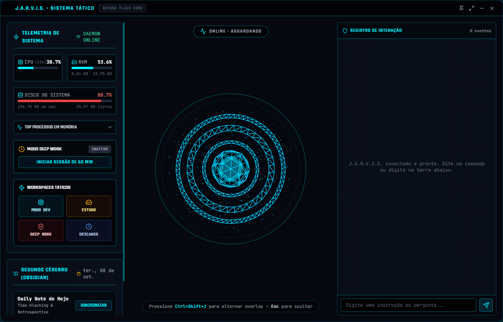
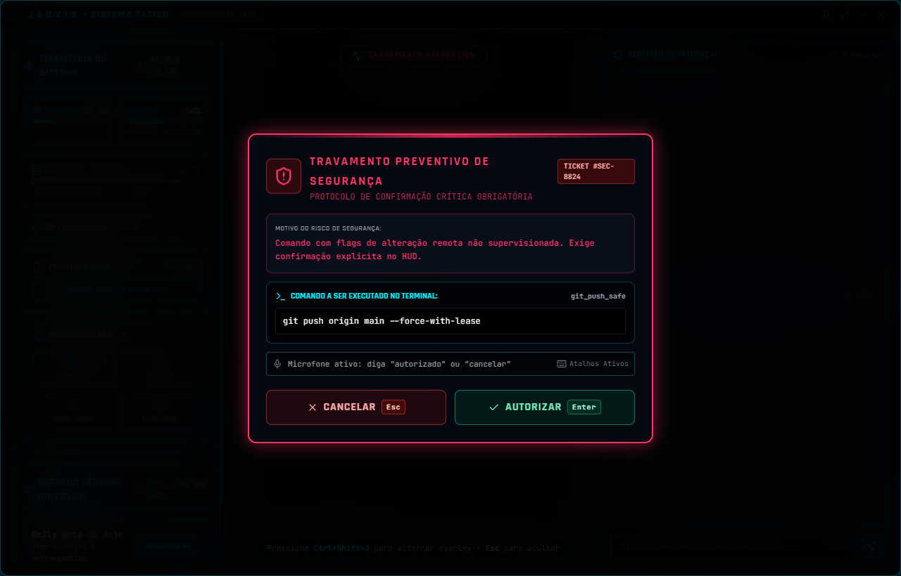
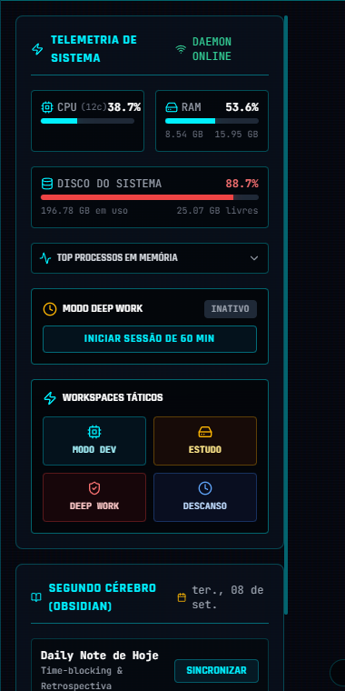
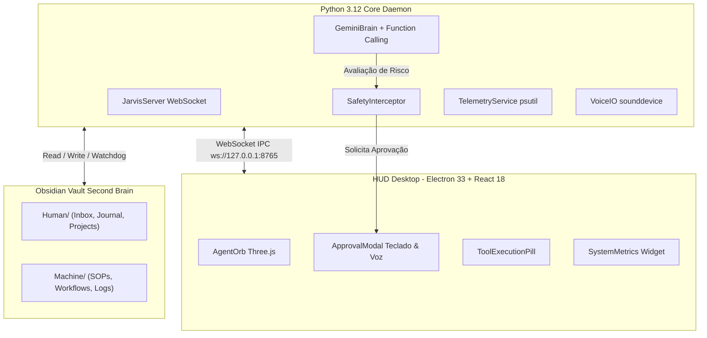

# J.A.R.V.I.S. — Just A Rather Very Intelligent System 🤖⚡

> **Segundo Cérebro Autônomo, Copiloto de Engenharia e Assistente Tático Desktop com Interface Holográfica em Tempo Real, integrado ao Obsidian e impulsionado pelo Google Gemini 2.5.**

---

## 📸 Demonstração da Interface (HUD Desktop)

| HUD Holográfico Ativo (AgentOrb 3D & Telemetria) | Travamento Preventivo de Governança |
| :---: | :---: |
|  |  |

| Painel de Telemetria de Hardware & Workspaces |
| :---: |
|  |

---

## 🌌 Visão Geral

O **J.A.R.V.I.S.** é um ecossistema de produtividade, engenharia e automação contínua projetado para desenvolvedores e pesquisadores. Ele atua como um companheiro sempre ativo na área de trabalho, conectando sua inteligência central (Python Core Daemon) a uma interface holográfica futurista flutuante (Electron + React + Three.js) e persistindo memória de longo prazo no seu cofre do **Obsidian**.

### Diferenciais do Sistema:
1. **Interface Holográfica Tática**: Janela desktop translúcida (*acrylic blur*), sem bordas tradicionais, com orquestrador de estados visuais em 3D e renderização de baixa latência.
2. **Visualizador de Áudio Reativo (AgentOrb)**: Núcleo WebGL com 3 anéis concêntricos contra-rotativos e partículas orbitais que reagem em tempo real aos estados do assistente (`idle`, `listening`, `thinking`, `speaking`) e à amplitude da voz.
3. **Governança & Segurança Supervisionada**: Matriz de permissões rígida que separa tarefas autônomas de baixo risco de operações críticas que exigem confirmação explícita no HUD (via teclado ou voz).
4. **Habilidades Vivas em SOPs**: Capacidade de ler e executar Procedimentos Operacionais Padrão diretamente de arquivos Markdown no cofre, auditando cada execução passo a passo.
5. **Telemetria de Baixo Overhead & Alertas Proativos**: Monitoramento contínuo de hardware (CPU, memória RAM, disco e top processos) com alertas visuais e sonoros antes que o sistema entre em sobrecarga.

---

## 🏛️ Arquitetura & Governança

O sistema adota uma arquitetura desacoplada e robusta orientada a eventos assíncronos:



### 1. Separação Estrutural do Cofre (Obsidian Vault)
O cofre local é dividido estritamente em duas camadas funcionais:

- **`Human/` (Domínio Cognitivo do Usuário)**:
  - `Human/Inbox/`: *Voice Scratchpad* para captura contínua e rápida de pensamentos, tarefas e referências ditadas.
  - `Human/Journal/`: Ciclo diário de produtividade (`YYYY-MM-DD.md`) com planejamento matinal em blocos de tempo (*time-blocking*), herança de pendências e retrospectiva noturna.
  - `Human/Projects/`: Notas atômicas interligadas por bi-links (`[[nota]]`) e tags contextuais.
- **`Machine/` (Domínio Operacional do Assistente)**:
  - `Machine/SOPs/`: Procedimentos Operacionais Padrão atômicos com frontmatter YAML e blocos executáveis.
  - `Machine/Workflows/`: Fluxos orquestrados de múltiplos passos encadeados.
  - `Machine/Logs/`: Logs de auditoria gerados a cada execução de rotina (`YYYY-MM-DD-sop-runs.md`).

### 2. Matriz de Governança e Travamento Preventivo
O J.A.R.V.I.S. opera sob o princípio do menor privilégio preventivo:

| Nível de Autonomia | Tipo de Operação | Ferramentas / Comandos | Comportamento |
| :--- | :--- | :--- | :--- |
| 🟢 **Autônomo (Livre)** | Leitura e Inspeção | `git_inspect`, `get_clipboard_content`, `get_system_telemetry`, `list_available_sops` | Execução imediata (0 tokens quando há atalho determinístico). |
| 🟢 **Autônomo (Livre)** | Testes & Verificação | `run_workspace_tests`, `pytest`, `check_service_health` | Executa no workspace ativo e reporta síntese de passed/failed. |
| 🟢 **Autônomo (Livre)** | Registro & Notas | `capture_to_inbox`, `setup_daily_journal`, `close_daily_journal` | Grava e atualiza arquivos no cofre do Obsidian. |
| 🔴 **Supervisionado (Bloqueio)** | Publicação Remota | `git_push_safe`, `git push` | **Trava Preventiva no HUD**. Exige `[Enter]` ou comando de voz (*"autorizado"*). |
| 🔴 **Supervisionado (Bloqueio)** | Exclusão Destrutiva | `docker_destructive_operation` (`down -v`, `prune`, `rm`), `del /f`, `rm -rf` | **Trava Preventiva no HUD**. Exibe ticket, motivo e comando antes de executar. |
| 🔴 **Supervisionado (Bloqueio)** | Elevação de Privilégios | `runas`, `sudo`, scripts de admin | **Trava Preventiva no HUD**. |

---

## 🛠️ Catálogo de Ferramentas (Gemini Tools)

Todas as ferramentas contam com atalhos determinísticos (`0 Tokens`) para comandos frequentes, além de integração completa com o **Gemini Function Calling SDK**:

### 1. Orquestração de Ambientes de Trabalho
- **`activate_workspace(mode: str)`**: Configura janelas, volumes de áudio, temporizadores e ferramentas táticas para 4 modos operacionais:
  - `dev`: Abre VS Code, navegador de desenvolvimento e Spotify com áudio equilibrado.
  - `study`: Foco em pesquisa, documentação técnica e notas do Obsidian.
  - `deep_work`: Modo imersivo de concentração com contagem regressiva e silenciamento de distrações.
  - `rest`: Fecha ferramentas pesadas e prepara o ambiente para descanso.

### 2. Assistente de Área de Transferência
- **`get_clipboard_content(max_length: int = 8000)`**: Inspeciona a área de transferência do Windows para depuração imediata de stacktraces e conversão de dados (ex: JSON para TypeScript).
- **`set_clipboard_content(text: str)`**: Grava dados gerados na área de transferência com notificação sonora.

### 3. Scratchpad & Journaling no Obsidian
- **`capture_to_inbox(content: str, entry_type: str, tags: list[str])`**: Anexa notas rápidas estruturadas com timestamp no arquivo `Human/Inbox/inbox.md`.
- **`setup_daily_journal(priorities: list[str], time_blocks: list)`**: Cria ou atualiza a Daily Note do dia (`Human/Journal/YYYY-MM-DD.md`) importando tarefas pendentes da Inbox e do dia anterior.
- **`close_daily_journal(reflection: str, energy_rating: int)`**: Consolida o encerramento do expediente, contabilizando tarefas concluídas vs pendentes e commits realizados.

### 4. Engenharia & Terminal
- **`git_inspect(mode: str)`**: Inspeciona alterações locais (`status`, `diff`, `last_commit`, `branch`).
- **`git_smart_commit(commit_type: str, scope: str, description: str)`**: Gera commits semânticos no padrão Conventional Commits com supervisão no HUD.
- **`git_push_safe(remote: str, branch: str)`**: Publicação remota protegida por trava de segurança.
- **`run_workspace_tests(command: str)`**: Detecta automaticamente a suíte de testes do projeto (`pytest`, `npm test`) e executa de forma assíncrona.

### 5. Infraestrutura Docker & Conectividade
- **`docker_inspect_services(all: bool)`**: Inspeciona containers ativos, portas expostas e tempo de atividade.
- **`docker_manage_service(action: str, target: str)`**: Inicia, encerra ou reinicia serviços (`postgres`, `redis`, etc.).
- **`docker_destructive_operation(action: str, target: str)`**: Operações de risco (limpeza de volumes e prune) sob supervisão de governança.
- **`check_service_health(target: str, port: int, endpoint: str)`**: Mede latência em milissegundos e integridade de sockets TCP e rotas HTTP (`GET /health`).

### 6. Habilidades Vivas em SOPs
- **`list_available_sops(category: str, query: str)`**: Lista o catálogo de procedimentos em `Machine/SOPs/` e workflows em `Machine/Workflows/`.
- **`execute_sop(sop_name: str, dry_run: bool)`**: Executa rotinas sequenciais passo a passo com suporte a simulação (*dry run*), travas de governança em passos críticos e auditoria detalhada em `Machine/Logs/`.

### 7. Telemetria de Hardware
- **`get_system_telemetry(metric: str)`**: Coleta uso de CPU (núcleos lógicos e físicos), memória RAM (utilizada/livre), ocupação do disco do sistema e os 5 processos que mais consom recursos.
- **Monitoramento Proativo em Background**: Alertas imediatos caso a RAM ultrapasse 88%, CPU atinja 90% contínuo ou o disco tenha menos de 10 GB livres (com debounce de 60 segundos).

---

## 💻 Stack Tecnológica

### Backend (Python Core Daemon)
- **Runtime**: Python 3.12 (64-bit)
- **Concorrência & IPC**: `asyncio`, `websockets` (servidor IPC local em `ws://127.0.0.1:8765`)
- **Inteligência Artificial**: `google-genai` SDK — Gemini 2.5 Flash (primário) com cascata de contingência para Gemini 2.5 Pro contra erros de pico (503/429)
- **Automação Windows**: `psutil` (telemetria e processos), `pyperclip` (clipboard), `ctypes` (Win32 user32), `winsound` / `sounddevice` (áudio e feedback sonoro)
- **Testes Automatizados**: `pytest 9.1`, `pytest-anyio`, `unittest.mock` (36 testes com 100% de aprovação)

### Frontend (HUD Desktop)
- **Runtime Nativo**: Electron 34 / 33 com IPC seguro via `contextBridge` e `preload.cjs` (sem expor `ipcRenderer`)
- **SPA Framework**: React 18 + TypeScript + Vite 6
- **Visualizador 3D**: Three.js (WebGL com shaders holográficos, anéis segmentados, wireframes icosaédricos, partículas orbitais e descarte de memória)
- **Estilização**: Tailwind CSS com paleta Stark Neon, scanlines de CRT e *Cyber Glassmorphism* (`backdrop-blur-2xl`)
- **Áudio & Reconhecimento**: Web Speech API (`webkitSpeechRecognition` para confirmação mãos-livres) e cancelamento imediato de fala (*Barge-in*)

---

## ⚙️ Configuração & Instalação

### Pré-requisitos
- **Windows 10 ou 11**
- **Python 3.12+** instalado e adicionado ao PATH
- **Node.js 20+** e **npm**
- Cofre do **Obsidian** instalado localmente (opcional, pasta criada por padrão)

### 1. Clonar o Repositório
```bash
git clone https://github.com/ViktorGabriel/Jarvis.git
cd Jarvis
```

### 2. Configurar o Ambiente Python
```powershell
# Criação do ambiente virtual
python -m venv venv

# Ativação do ambiente
.\venv\Scripts\Activate.ps1

# Instalação das dependências
pip install -r core/requirements.txt
```

### 3. Configurar Variáveis de Ambiente
Copie o modelo de variáveis de ambiente e configure suas credenciais no arquivo `.env`:
```powershell
copy .env.example .env
```

Edite o arquivo `.env`:
```env
# Chave da API do Google AI Studio (Gemini 2.5)
GEMINI_API_KEY=sua_chave_do_gemini_aqui

# Caminho absoluto do seu cofre do Obsidian
OBSIDIAN_VAULT_PATH=C:/Users/Viktor/Documents/Obsidian

# Host e Porta do Servidor WebSocket IPC
WS_HOST=127.0.0.1
WS_PORT=8765
```

### 4. Instalar Dependências do HUD
```powershell
cd hud
npm install
cd ..
```

---

## 🚀 Como Executar

### Opção 1: Inicializador Rápido de Comando Único
Execute o script de inicialização que sobe o Core Daemon e o HUD simultaneamente:
```powershell
.\start.bat
```

### Opção 2: Inicialização Separada por Terminais

**Terminal 1 — Core Daemon (Python)**:
```powershell
.\venv\Scripts\python core\main.py
```

**Terminal 2 — HUD Desktop (Electron + Vite)**:
```powershell
cd hud
npm run start
```

---

## ⌨️ Atalhos do HUD Desktop

| Atalho | Contexto | Ação |
| :--- | :--- | :--- |
| <kbd>Ctrl</kbd> + <kbd>Shift</kbd> + <kbd>J</kbd> | Global no SO | Alterna visibilidade do HUD e dá foco prioritário ao campo de digitação. |
| <kbd>Esc</kbd> | Fora de modais | Oculta a janela do HUD instantaneamente sem encerrar o processo de fundo. |
| <kbd>Esc</kbd> | No Modal de Governança | **Cancela/Rejeita** a operação crítica imediatamente. |
| <kbd>Enter</kbd> | No Modal de Governança | **Autoriza** a execução do comando imediatamente. |
| **Voz: "autorizado"** | No Modal de Governança | Confirmação por voz via Web Speech API (mãos-livres). |
| **Voz: "cancelar"** | No Modal de Governança | Rejeição por voz via Web Speech API. |
| **Voz durante fala** | No estado `speaking` | **Barge-in**: Interrompe a saída de áudio instantaneamente ao detectar a voz do usuário. |

---

## 🧪 Validação e Testes Automatizados

O projeto conta com uma suíte de testes automatizados com cobertura completa para governança, Obsidian, Git, Docker, SOPs e telemetria:

```powershell
# Executar suíte completa de testes
.\venv\Scripts\pytest tests/ -v
```

Resultado da validação do sistema:
```text
============================= 36 passed in 10.33s =============================
```

Para validar a compilação de produção do HUD:
```powershell
cd hud
npm run build
```

---

## 📜 Licença

Desenvolvido para fins de pesquisa, produtividade e engenharia de software avançada. Código aberto sob a licença [MIT](LICENSE).
